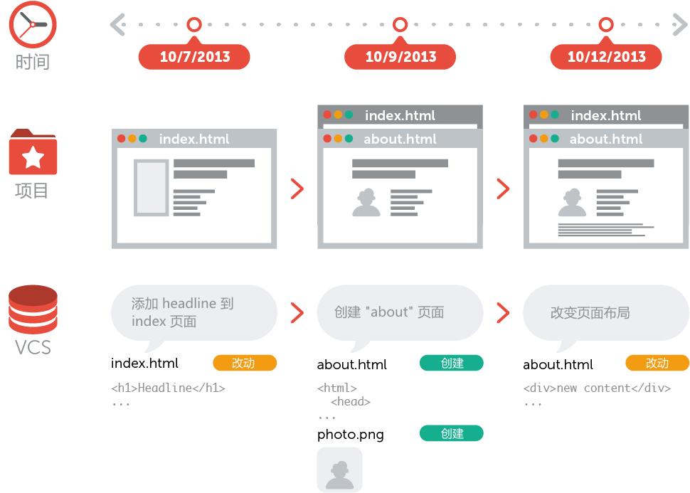

# git 讲解

## 1.起步

### 1.1 版本控制简介

你可以把一个版本控制系统（缩写VCS）理解为一个“数据库”，在需要的时候，它可以帮你完整地保存一个项目的快照。当你需要查看一个之前的快照（称之为“版本”）时，版本控制系统可以显示出当前版本与上一个版本之间的所有改动的细节。



版本控制与项目的种类，使用的技术和基础框架并无关系：

- 无论是设计开发一个HTML网站或者是一个苹果应用，它的工作原理都是一样的。
- 你可以选择任何你喜欢的工具来工作，它并不关心你用什么样的文本编辑器，绘图程序，文件管理器或其他工具。

版本控制系统会记录所有对项目文件的更改。这就是版本控制，听起来很简单。

###  1.2 为什么要使用版本控制系统

#### 协同合作

试想一下，如果没有版本控制系统，当你需要处理那些共享文件夹中的文件时，你必须告知办公室里的所有人，你正在对哪些文件进行编辑；与此同时，其他人必须要避免与操作相同的文件。这是一个不现实和完全错误的流程。当你花了很长时间完成你的编辑后，可能这些文件早已经被团队里的其他开发成员修改或者删除了。

如果使用了版本控制系统，每一个团队成员都可以在任何时间对任何文件毫无顾虑的进行修改，版本控制系统可以把之后所有的改动合并成一个共同的版本，不论是一个文件还是整个项目。这个共同的中心平台就是我们的版本控制系统。

使用版本控制还有更多优点，这就要取决于你自己或者你的开发团队了。

#### 版本存储

经常性地保存项目的改动是一个非常重要的习惯。但是如果没有版本控制系统这个操作将是非常困难的，并且非常容易出错的：

- 你到底改动了什么？仅仅是针对一些特定文件的改动还是整个项目？首先你必须及时并小心地审查整个项目的每一个可能的改动细节，然后你需要付出大量且并不必要的时间来整理它。
- 你如何命名这些版本？如果你是一个思维很有条理的人，你也许会定义一个比较容易理解的通用命名规则（比如这样 “acme-inc-redesign-2013-11-12-v23”）。然而一旦涉及到一个多样性的改变（比如：在一次版本改动中，一些改动了标题区而另一些却没有被改动它），仅仅通过名字是很难追踪和判断这些改动的。
- 最重要的问题可能就是你如何知道在第一个版本和第二个版本之间到底进行了哪些改动？只有很少人会真正地去花时间来仔细记录和观察每一个重要的变化，例如在项目文件夹的每一个README文件。

每一个版本控制系统仅仅对应一个项目。因此，在你的本地只存在一个版本，那就是这个项目的当前工作版本。除此之外，而其它所有之前的版本和改动都已经被有序地存储在版本控制系统中了。当你需要时，你可以随时来查看之前的任何一个版本，而且还可以得到整个项目的快照。

#### 恢复之前的版本

要把一些文件恢复到上次改动之前的版本（甚至整个项目恢复到之前的版本）。这可能意味着你发现了一些严重的问题！如果你确定那些改动是错误的或者是没有必要的，那轻松的点几下你就可以简单地撤销它。在项目的每一个重要阶段，认识和正确地使用撤销这个功能会让你的工作变得非常轻松。

#### 了解发生了什么

每当你提交一次对项目新的改动时，你的版本管理系统会要求你添加一个对这次改动的简短描述。除此之外（如果是一个代码或者文本文件），你还可以看到一个改动前和改动后的内容的详细对照。这样也可以帮助你很好地了解版本与版本之间的发展关系。

#### 备份

备份是一个分布式版本控制系统（例如 Git）提供的非常好的附带功能。每一个团队成员都会在他的本地有一个完整的项目副本，包括整个项目的历史记录。如果你所依赖的服务器宕机了，或者是你的存储硬盘坏，所有你需要的恢复文件都可以在另外的团队成员的 Git 本地仓库中得到。

### 1.3 有哪些版本控制系统

许多人习惯用复制整个项目目录的方式来保存不同的版本，或许还会改名加上备份时间以示区别。 这么做唯一的好处就是简单，但是特别容易犯错。 有时候会混淆所在的工作目录，一不小心会写错文件或者覆盖意想外的文件。

#### 本地版本控制系统


其中最流行的一种叫做 RCS，现今许多计算机系统上都还看得到它的踪影。 [RCS](https://www.gnu.org/software/rcs/) 的工作原理是在硬盘上保存补丁集（补丁是指文件修订前后的变化）；通过应用所有的补丁，可以重新计算出各个版本的文件内容。

#### 集中化的版本控制系统


这种做法带来了许多好处，特别是相较于老式的本地 VCS 来说。 现在，每个人都可以在一定程度上看到项目中的其他人正在做些什么。 而管理员也可以轻松掌控每个开发者的权限，并且管理一个 CVCS 要远比在各个客户端上维护本地数据库来得轻松容易。

事分两面，有好有坏。 这么做最显而易见的缺点是中央服务器的单点故障。 如果宕机一小时，那么在这一小时内，谁都无法提交更新，也就无法协同工作。 如果中心数据库所在的磁盘发生损坏，又没有做恰当备份，毫无疑问你将丢失所有数据——包括项目的整个变更历史，只剩下人们在各自机器上保留的单独快照。 本地版本控制系统也存在类似问题，只要整个项目的历史记录被保存在单一位置，就有丢失所有历史更新记录的风险。

#### 分布式版本控制系统


更进一步，许多这类系统都可以指定和若干不同的远端代码仓库进行交互。籍此，你就可以在同一个项目中，分别和不同工作小组的人相互协作。 你可以根据需要设定不同的协作流程，比如层次模型式的工作流，而这在以前的集中式系统中是无法实现的。

### 1.4 git

**git**是一个[分布式版本控制](https://zh.wikipedia.org/wiki/分散式版本控制)软件，最初由[林纳斯·托瓦兹](https://zh.wikipedia.org/wiki/林纳斯·托瓦兹)创作，于2005年以[GPL](https://zh.wikipedia.org/wiki/GPL)发布。最初目的是为更好地管理[Linux内核](https://zh.wikipedia.org/wiki/Linux内核)开发而设计。

自2002年开始，林纳斯·托瓦兹决定使用BitKeeper作为Linux内核主要的版本控制系统用以维护代码。因为BitKeeper为[专有软件](https://zh.wikipedia.org/wiki/专有软件)，这个决定在社群中长期遭受质疑。在Linux社群中，特别是[理查德·斯托曼](https://zh.wikipedia.org/wiki/理查德·斯托曼)与[自由软件基金会](https://zh.wikipedia.org/wiki/自由軟體基金會)的成员，主张应该使用开放源代码的软件来作为Linux内核的版本控制系统。林纳斯·托瓦兹曾考虑过采用现成软件作为版本控制系统（例如Monotone），但这些软件都存在一些问题，特别是性能不佳。现成的方案，如[CVS](https://zh.wikipedia.org/wiki/協作版本系統)的架构，受到林纳斯·托瓦兹的批评。

2005年，[安德鲁·垂鸠](https://zh.wikipedia.org/wiki/安德魯·垂鳩)写了一个简单程序，可以连接BitKeeper的存储库，BitKeeper著作权拥有者[拉里·麦沃伊](https://zh.wikipedia.org/wiki/拉里·麥沃伊)认为安德鲁·垂鸠对BitKeeper内部使用的[协议](https://zh.wikipedia.org/wiki/网络传输协议)进行[逆向工程](https://zh.wikipedia.org/wiki/逆向工程)，决定收回无偿使用BitKeeper的许可。Linux内核开发团队与BitMover公司进行磋商，但无法解决他们之间的歧见。林纳斯·托瓦兹决定自行开发版本控制系统替代BitKeeper，以十天的时间编写出git第一个版本。

### 1.5 命令行

Git 有多种使用方式。 你可以使用原生的命令行模式，也可以使用 GUI 模式，这些 GUI 软件也能提供多种功能。 假如你是 macOS 用户，我们希望你懂得如何使用终端（Terminal）；假如你是 Windows 用户，我们希望你懂得如何使用命令窗口（Command Prompt）或 PowerShell。强烈建议大家在开始的时候使用命令行学习git。

### 1.6 git安装

苹果电脑（macos系统）或者Ubuntu安装教程，自行上网查找，主要以windows为例。

#### windows安装

官网下载，打开https://git-scm.com/download/win，就可以自动开始下载。下载完成之后，直接按提示安装就可以了。

### 1.7 初次使用git前配置

安装好git之后，首次使用前我们需要配置下git的环境。后续即使是升级都会保留配置信息，并且我们后续也可以通过运行命令修改配置。

`git config` 命令可以对git的外观和行为进行设置。这些设置存在三个不同的位置：

1. `/etc/gitconfig` 文件: 包含系统上每一个用户及他们仓库的通用配置。 如果在执行 `git config` 时带上 `--system` 选项，那么它就会读写该文件中的配置变量。 （由于它是系统配置文件，因此你需要管理员或超级用户权限来修改它。）
2. `~/.gitconfig` 或 `~/.config/git/config` 文件：只针对当前用户。 你可以传递 `--global` 选项让 Git 读写此文件，这会对你系统上 **所有** 的仓库生效。
3. 当前使用仓库的 Git 目录中的 `config` 文件（即 `.git/config`）：针对该仓库。 你可以传递 `--local` 选项让 Git 强制读写此文件，虽然默认情况下用的就是它。。 （当然，你需要进入某个 Git 仓库中才能让该选项生效。）

配置文件依次会覆盖上一级别的配置

#### 重点（配置用户信息）

```shell
git config --global user.name 'huirui'
git config --global user.email '1017669154@qq.com'
```

如果使用了 `--global` 选项，那么该命令只需要运行一次，因为之后无论你在该系统上做任何事情， Git 都会使用那些信息。 当你想针对特定项目使用不同的用户名称与邮件地址时，可以在那个项目目录下运行没有 `--global` 选项的命令来配置。

很多`GUI`(图形化界面)工具第一次运行时都会帮你配置这些信息

#### 检查配置

```shell
git config --list
```

#### 查看具体某一项配置

```shell
git config user.name
```

### 1.8 git帮助命令

通过一下三种方式可以查看git命令的综合手册（manpage)

```shell
git help init
git init --help
man git-init (linux操作系统使用)
```

如果不需要全面的手册可以使用-h选项获取简明的输出：

```shell
git init -h
```

## 2.git基础

### 2.1获取git仓库

通常有两种方式获取git仓库：

1、将本地尚未进行版本控制的项目目录转换为git仓库

2、从远程的服务器 **克隆**一个已经存在的git仓库

两种方式都可以在你的本地机器上得到一个工作就绪的git仓库

#### 在已经存在的目录中初始化仓库

如果你有一个尚未进行版本控制的项目目录，想要用 Git 来控制它，那么首先需要进入该项目目录中。

之后执行：

```shell
git init
```

该命令会创建一个名为.git的子目录，这个子目录含有你初始化git仓库中所有的必须文件，这些文件是git仓库的骨干。但是，这个时候，我们仅仅只是做了一个初始化的操作，你的项目里的文件还没有被跟踪。（后面会讲解.git文件夹包含了哪些文件信息）

如果在一个已存在文件的文件夹（而非空文件夹）中进行版本控制，你应该开始追踪这些文件并进行初始提交。 可以通过 `git add` 命令来指定所需的文件来进行追踪，然后执行 `git commit` ：

```shell
git add *
git commit -m '初始化项目'
```

稍后我们再逐一解释这些指令的行为。 现在，你已经得到了一个存在被追踪文件与初始提交的 Git 仓库。

#### 克隆现有的仓库

如果你想获得一份已经存在了的 Git 仓库的拷贝，比如说，你想为vue.js开源项目贡献自己的一份力，这时就要用到 `git clone` 命令。

Git 区别于其它版本控制系统的一个重要特性，Git 克隆的是该 Git 仓库服务器上的几乎所有数据，而不是仅仅复制完成你的工作所需要文件。 当你执行 `git clone` 命令的时候，默认配置下远程 Git 仓库中的每一个文件的每一个版本都将被拉取下来。 事实上，如果你的服务器的磁盘坏掉了，你通常可以使用任何一个克隆下来的用户端来重建服务器上的仓库

克隆仓库的命令是`git clone <url>`。比如，要克隆vuejs的git仓库，可以使用下面命令：

```shell
git clone https://github.com/vuejs/vue
```

这会在当前目录下创建一个名为 “vue” 的目录，并在这个目录下初始化一个 `.git` 文件夹， 从远程仓库拉取下所有数据放入 `.git` 文件夹，然后从中读取最新版本的文件的拷贝。 如果你进入到这个新建的 vue文件夹，你会发现所有的项目文件已经在里面了，准备就绪等待后续的开发和使用。

如果你想在克隆远程仓库的时候，自定义本地仓库的名字，你可以通过额外的参数指定新的目录名：

```shell
git clone https://github.com/vuejs/vue vuejs
```

这会执行与上一条命令相同的操作，但目标目录名变为了 `vuejs`。

Git 支持多种数据传输协议。 上面的例子使用的是 `https://` 协议，不过你也可以使用 `git://` 协议或者使用 SSH 传输协议，比如 `user@server:path/to/repo.git`  （后面将会介绍所有这些协议在服务器端如何配置使用，以及各种方式之间的利弊。）

### 2.2记录每次更新到仓库

现在我们的机器上有了一个 **真实项目** 的 Git 仓库，并从这个仓库中检出了所有文件的 **工作副本**。 通常，你会对这些文件做些修改，每当完成了一个阶段的目标，想要将记录下它时，就将它提交到仓库。

请记住，你工作目录下的每一个文件都不外乎这两种状态：**已跟踪** 或 **未跟踪**。 已跟踪的文件是指那些被纳入了版本控制的文件，在上一次快照中有它们的记录，在工作一段时间后， 它们的状态可能是未修改，已修改或已放入暂存区。简而言之，已跟踪的文件就是 Git 已经知道的文件。

工作目录中除已跟踪文件外的其它所有文件都属于未跟踪文件，它们既不存在于上次快照的记录中，也没有被放入暂存区。 初次克隆某个仓库的时候，工作目录中的所有文件都属于已跟踪文件，并处于未修改状态，因为 Git 刚刚检出了它们， 而你尚未编辑过它们。

编辑过某些文件之后，由于自上次提交后你对它们做了修改，Git 将它们标记为已修改文件。 在工作时，你可以选择性地将这些修改过的文件放入暂存区，然后提交所有已暂存的修改，如此反复。


#### 检查当前文件状态

可以用 `git status` 命令查看哪些文件处于什么状态。 如果在克隆仓库后立即使用此命令，会看到类似这样的输出：

```shell
git status
On branch master
Your branch is up-to-date with 'origin/master'.
nothing to commit, working directory clean
```

这说明你现在的工作目录相当干净。换句话说，所有已跟踪文件在上次提交后都未被更改过。 此外，上面的信息还表明，当前目录下没有出现任何处于未跟踪状态的新文件，否则 Git 会在这里列出来。 最后，该命令还显示了当前所在分支，并告诉你这个分支同远程服务器上对应的分支没有偏离。 现在，分支名是“master”,这是默认的分支名。 我们在 分支部分 会详细讨论分支和引用。

现在，让我们在项目下创建一个新的 `README` 文件。 如果之前并不存在这个文件，使用 `git status` 命令，你将看到一个新的未跟踪文件：

```shell
 git status
On branch master
Your branch is up-to-date with 'origin/master'.
Untracked files:
  (use "git add <file>..." to include in what will be committed)

    README

nothing added to commit but untracked files present (use "git add" to track)
```

在状态报告中可以看到新建的 `README` 文件出现在 `Untracked files` 下面。 未跟踪的文件意味着 Git 在之前的快照（提交）中没有这些文件；Git 不会自动将之纳入跟踪范围，除非你明明白白地告诉它“我需要跟踪该文件”。 这样的处理让你不必担心将生成的二进制文件或其它不想被跟踪的文件包含进来。 不过现在的例子中，我们确实想要跟踪管理 `README` 这个文件。

#### 跟踪新文件

使用命令 `git add` 开始跟踪一个文件。 所以，要跟踪 `README` 文件，运行：

```shell
git add README
```

此时再运行 `git status` 命令，会看到 `README` 文件已被跟踪，并处于暂存状态:

```console
git status
On branch master
Your branch is up-to-date with 'origin/master'.
Changes to be committed:
  (use "git restore --staged <file>..." to unstage)

    new file:   README
```

只要在 `Changes to be committed` 这行下面的，就说明是已暂存状态。 如果此时提交，那么该文件在你运行 `git add` 时的版本将被留存在后续的历史记录中。 你可能会想起之前我们使用 `git init` 后就运行了 `git add <files>` 命令，开始跟踪当前目录下的文件。 `git add` 命令使用文件或目录的路径作为参数；如果参数是目录的路径，该命令将递归地跟踪该目录下的所有文件。

#### 暂存已修改的文件

现在我们来修改一个已被跟踪的文件。 如果你修改了一个名为` README.md` 的已被跟踪的文件，然后运行 `git status` 命令，会看到下面内容：

```console
git status
On branch master
Your branch is up-to-date with 'origin/master'.
Changes to be committed:
  (use "git reset HEAD <file>..." to unstage)

    new file:   README

Changes not staged for commit:
  (use "git add <file>..." to update what will be committed)
  (use "git checkout -- <file>..." to discard changes in working directory)

    modified:   README.md
```

文件 `README.md` 出现在 `Changes not staged for commit` 这行下面，说明已跟踪文件的内容发生了变化，但还没有放到暂存区。 要暂存这次更新，需要运行 `git add` 命令。 这是个多功能命令：可以用它开始跟踪新文件，或者把已跟踪的文件放到暂存区，还能用于合并时把有冲突的文件标记为已解决状态等。 将这个命令理解为“精确地将内容添加到下一次提交中”而不是“将一个文件添加到项目中”要更加合适。 现在让我们运行 `git add` 将`README.md`放到暂存区，然后再看看 `git status` 的输出：

```console
git add README.md
git status
On branch master
Your branch is up-to-date with 'origin/master'.
Changes to be committed:
  (use "git reset HEAD <file>..." to unstage)

    new file:   README
    modified:   REAMDE.md
```

现在两个文件都已暂存，下次提交时就会一并记录到仓库。 假设此时，你想要在 `README.md` 里再加条注释。 重新编辑存盘后，准备好提交。 不过且慢，再运行 `git status` 看看：

```console
git status
On branch master
Your branch is up-to-date with 'origin/master'.
Changes to be committed:
  (use "git reset HEAD <file>..." to unstage)

    new file:   README
    modified:   README.md

Changes not staged for commit:
  (use "git add <file>..." to update what will be committed)
  (use "git checkout -- <file>..." to discard changes in working directory)

    modified:   README.md
```

怎么回事？ 现在 `README.md` 文件同时出现在暂存区和非暂存区。 这怎么可能呢？ 好吧，实际上 Git 只不过暂存了你运行 `git add` 命令时的版本。 如果你现在提交，`README.md` 的版本是你最后一次运行 `git add` 命令时的那个版本，而不是你运行 `git commit` 时，在工作目录中的当前版本。 所以，运行了 `git add` 之后又作了修订的文件，需要重新运行 `git add` 把最新版本重新暂存起来：

```console
git add README.md
$ git status
On branch master
Your branch is up-to-date with 'origin/master'.
Changes to be committed:
  (use "git reset HEAD <file>..." to unstage)

    new file:   README
    modified:   README.md
```

#### 状态简览

`git status` 命令的输出十分详细，但其用语有些繁琐。 Git 有一个选项可以帮你缩短状态命令的输出，这样可以以简洁的方式查看更改。 如果你使用 `git status -s` 命令或 `git status --short` 命令，你将得到一种格式更为紧凑的输出。

```shell
git status -s
MM git-scm.md
?? index.js
```

新添加的未跟踪文件前面有 `??` 标记，新添加到暂存区中的文件前面有 `A` 标记，修改过的文件前面有 `M` 标记。 输出中有两栏，左栏指明了暂存区的状态，右栏指明了工作区的状态。 `git-scm.md` 文件已修，暂存后又作了修改，因此该文件的修改中既有已暂存的部分，又有未暂存的部分。

#### 忽略文件

一般我们总会有些文件无需纳入 Git 的管理，也不希望它们总出现在未跟踪文件列表。 通常都是些自动生成的文件，比如日志文件，或者编译过程中创建的临时文件等。 在这种情况下，我们可以创建一个名为 `.gitignore` 的文件，列出要忽略的文件的模式。 来看一个实际的 `.gitignore` 例子：